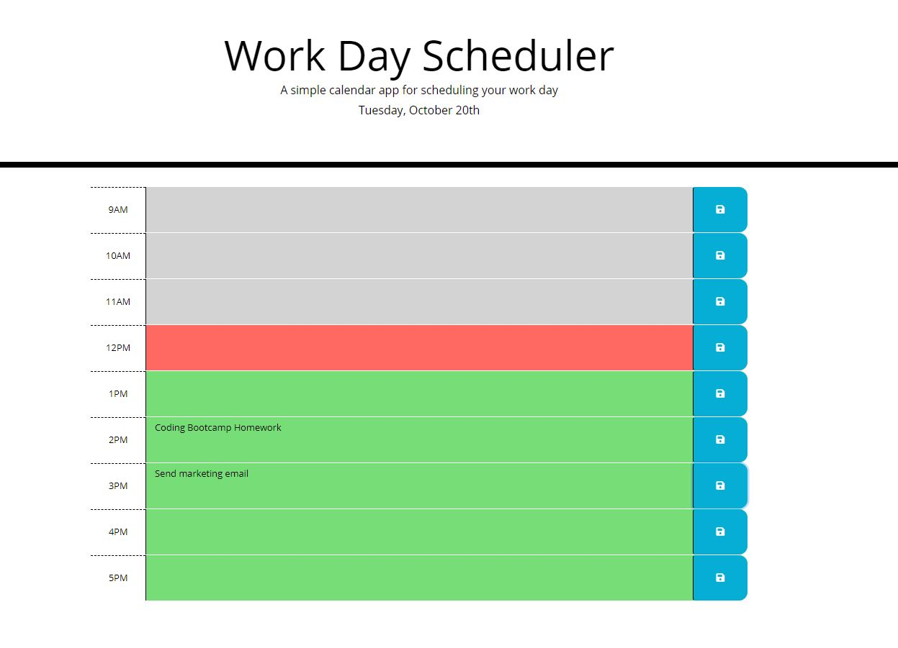

# Work Day Scheduler
  A simple calendar application that allows the user to save events for each hour of the day.

  ## Badges 
  

  ## Table of Contents 
  * [Description](#description)
  * [Screenshot](#screenshot)
  * [Deployed Application](#deployedapp)
  * [License](#license)
  * [Questions](#questions)
  
  ## Screenshot
  

  ## Deployed Application
  https://donellt.github.io/work-day-scheduler/

  ## License
  This project is licensed under the MIT license.

  ## Questions
  You can email me at donelltorres@yahoo.com if you have any questions!
